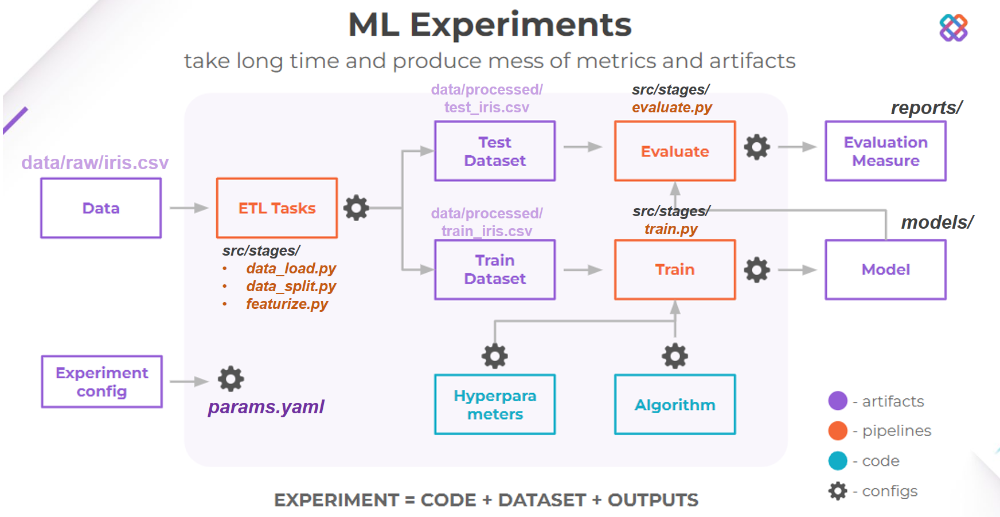
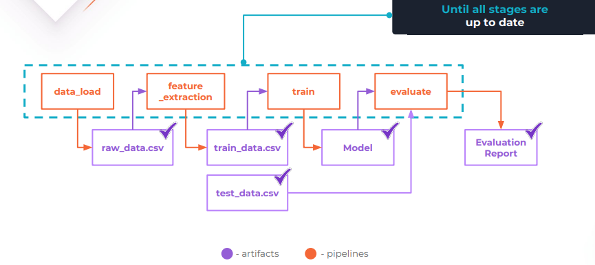

<a target="_blank" href="https://cookiecutter-data-science.drivendata.org/">
    
</a>


Learning DVC tools for MLOps following this course: https://learn.dvc.ai/

## Project Organization

```
├── LICENSE            <- Open-source license if one is chosen
├── Makefile           <- Makefile with convenience commands like `make data` or `make train`
├── README.md          <- The top-level README for developers using this project.
├── data
│   ├── processed      <- The final, canonical data sets for modeling.
│   └── raw            <- The original, immutable data dump.
│
├── models             <- Trained and serialized models, model predictions, or model summaries
│
├── notebooks          <- Jupyter notebooks. Naming convention is a number (for ordering),
│                         the creator's initials, and a short `-` delimited description, e.g.
│                         `1.0-jqp-initial-data-exploration`.
│
├── pyproject.toml     <- Project configuration file with package metadata for 
│                         learndvc and configuration for tools like black
│
├── reports            <- Generated analysis as HTML, PDF, LaTeX, etc.
│   └── figures        <- Generated graphics and figures to be used in reporting
│
├── requirements.txt   <- The requirements file for reproducing the analysis environment, e.g.
                          generated with `pip freeze > requirements.txt`

```

---


##  Chapter 3: Pipelines Automation & Configuration
<details open>
<summary>Each step below show improvement in ML Pipelines:</summary>

- [Step 0](notebooks/step-0-prototype.ipynb): Only use Notebook to code full pipeline (run all)

- [Step 1](notebooks/step-1-organize-ml-project.ipynb): Store data after each stage and organize ML project

- [Step 2](notebooks/step-2-create-config-file.ipynb): Using yaml as config file to manage params of project (dataset path, save path,...)

- [Step 3](notebooks/step-3-reusable-code.ipynb): Create Python Module for reuse helpful function

- [Step 4](notebooks/step-4-build-ml-pipeline.ipynb): Create simple ML Pipeline (still need run each stage by stage)


- [Step 5](notebooks/step-5-automate-ml-pipeline.ipynb): Create automate ML Pipeline using DVC (run all pipeline in 1 command)

[export pipeline graph](figs/dag.md)

</details>

